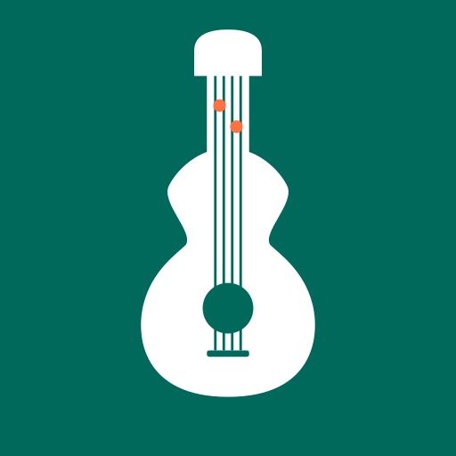
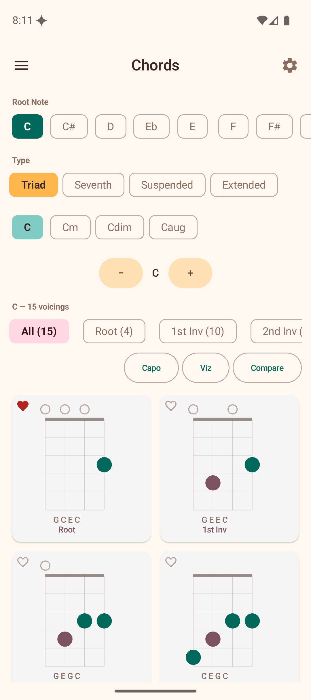
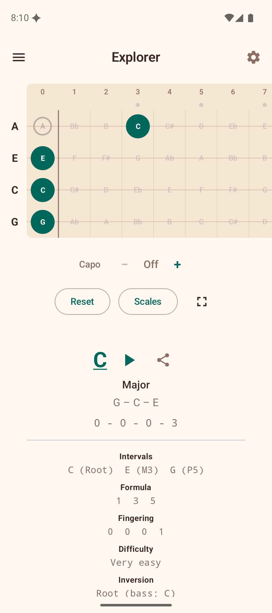
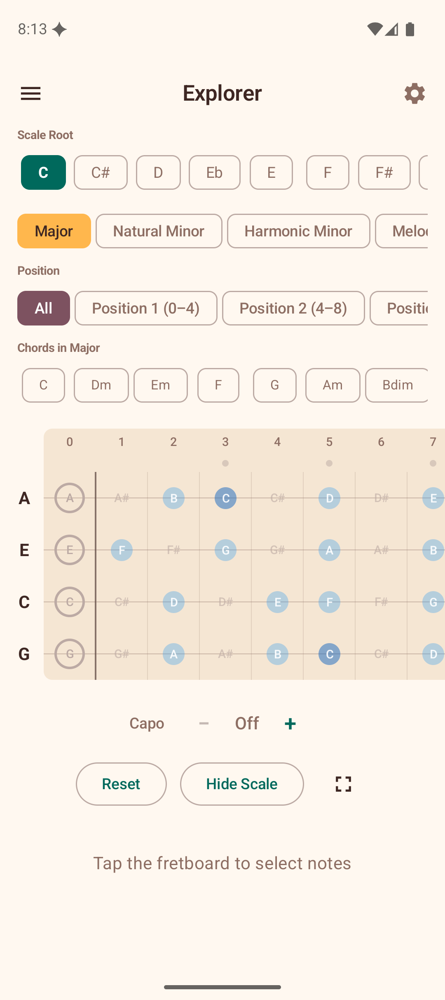
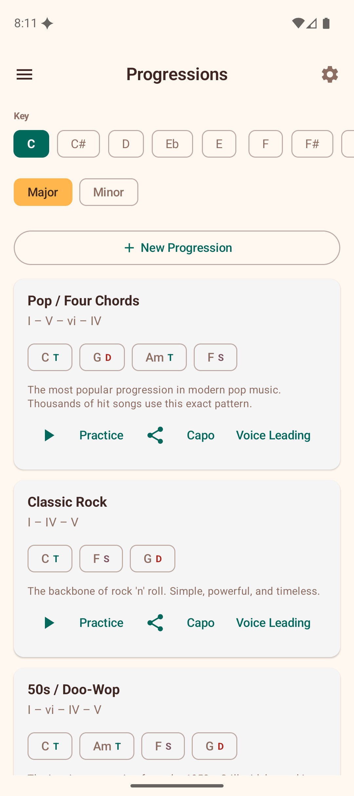
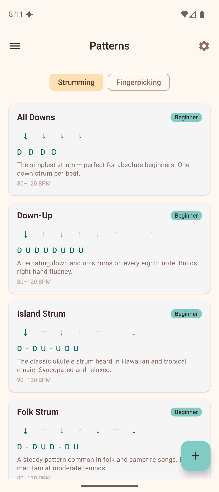
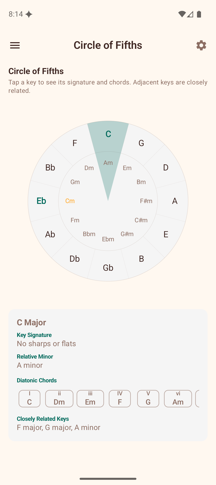

---
hide:
  - navigation
  - toc
---

# Ukulele Companion

<section class="hero-shell">
  

    

      
      Ukulele Companion
    

    
Free. Offline. Ad-free.

    <h1>The complete practice companion for ukulele players.</h1>
    

      Master chords, explore scales, train your ear, and build real songs in one
      beautiful Android experience designed for daily practice.
    

    

      [Start with the Manual](manual/index.md){ .md-button .md-button--primary }
      [View on GitHub](https://github.com/baijum/ukulele-companion){ .md-button }
    

    

      
<strong>30+</strong>learning screens

      
<strong>100%</strong>offline capable

      
<strong>0</strong>ads or tracking

    

  

  

    
    
  

</section>

<section class="value-strip">
  Chord Detection
  Scale Overlay
  Progressions
  Ear Training
  Song Chord Sheets
  Circle of Fifths
</section>

## Built for focused practice

  <article class="feature-card">
    <h3>Interactive Fretboard</h3>
    
Tap notes and instantly detect chords with visual feedback that mirrors your actual instrument.

  </article>
  <article class="feature-card">
    <h3>Smart Learning Flow</h3>
    
Seamlessly move from chord lookup to progressions, scales, and training without losing context.

  </article>
  <article class="feature-card">
    <h3>Play, Not Configure</h3>
    
No login, no account setup, and no tracking prompts interrupting your creative flow.

  </article>
  <article class="feature-card">
    <h3>Music Theory That Clicks</h3>
    
Use practical visuals like the circle of fifths and interval tools to connect theory with the songs you love.

  </article>

## In-app experience

  <figure>
    
    <figcaption>Real-time chord detection</figcaption>
  </figure>
  <figure>
    
    <figcaption>Scale notes on fretboard</figcaption>
  </figure>
  <figure>
    
    <figcaption>Practice progressions in any key</figcaption>
  </figure>
  <figure>
    
    <figcaption>Playable voicing library</figcaption>
  </figure>
  <figure>
    
    <figcaption>Strumming and rhythm patterns</figcaption>
  </figure>
  <figure>
    
    <figcaption>Visual music theory tools</figcaption>
  </figure>

<section class="cta-panel" markdown>
  <h2>Start playing better in minutes</h2>
  
Use the manual to get up and running, then explore the feature that matches your current goal.

  

    [Read manual overview](manual/index.md){ .md-button .md-button--primary }
    [Go to getting started](manual/01-getting-started.md){ .md-button }
  

  

    [Privacy Policy](privacy-policy.md)
  

</section>
