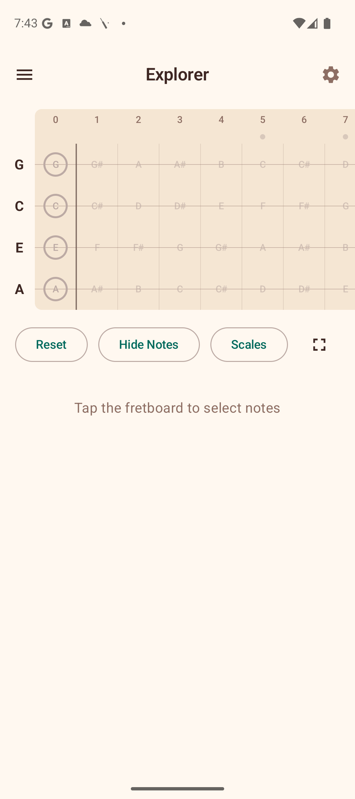
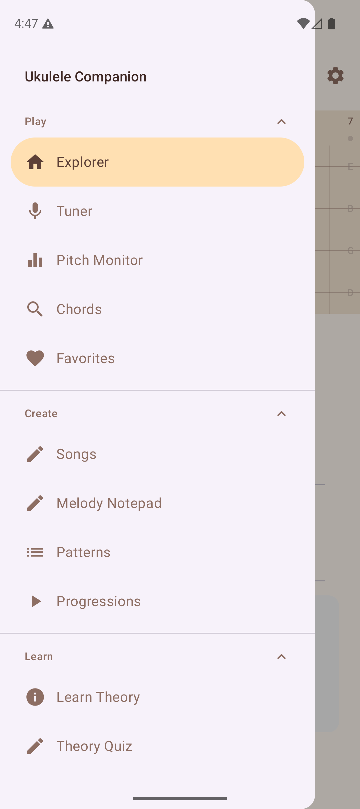

# Getting Started

## Installing the App

Ukulele Companion is available as an Android APK. Install it on any device running Android 8.0 (Oreo) or later. No account or login is required — just install and open.

## First Launch

When you open the app for the first time, you land on the **Explorer** tab. This is the interactive fretboard where you can tap fret positions and the app will detect chords for you.

## Navigating the App

The app uses a **navigation drawer** to move between sections. Tap the hamburger menu icon (three horizontal lines) in the top-left corner to open the drawer.

The drawer is organised into four groups:

### Play

| Section | What It Does |
|---------|-------------|
| **Explorer** | Interactive fretboard with chord detection |
| **Tuner** | Chromatic tuner using the microphone |
| **Pitch Monitor** | Real-time pitch visualisation graph |
| **Chords** | Browse the chord library by root and type |
| **Favorites** | Your saved chord voicings |
| **Song Finder** | Discover songs based on chords you know |

### Create

| Section | What It Does |
|---------|-------------|
| **Songs** | Personal songbook with chord sheets, ChordPro import/export |
| **Melody Notepad** | Simple melody composition tool |
| **Patterns** | Strumming and fingerpicking pattern reference |
| **Progressions** | Common chord progressions in any key |

### Learn

| Section | What It Does |
|---------|-------------|
| **Learn Theory** | Structured theory lessons |
| **Theory Quiz** | Test your music theory knowledge |
| **Interval Trainer** | Ear training for intervals |
| **Note Quiz** | Fretboard note identification quiz |
| **Chord Ear Training** | Identify chord types by ear |
| **Scale Practice** | Guided scale exercises on the fretboard |
| **Progress** | Dashboard with learning stats and practice timer |
| **Daily Challenge** | Three fresh challenges every day |
| **Practice Routine** | Guided practice session builder |
| **SRS Review** | Spaced repetition for chord memorisation |
| **Chord Transitions** | Animated finger movement between chords |
| **Play Along** | Real-time play-along with chord detection |
| **Achievements** | Milestone gallery and progress tracking |

### Reference

| Section | What It Does |
|---------|-------------|
| **Capo Guide** | Educational capo reference |
| **Circle of Fifths** | Visual key relationship chart |
| **Chord Substitutions** | Guide to chord substitutions |
| **Chords in Scale** | Diatonic chords for any scale |
| **Fretboard Notes** | Visual note map of the fretboard |
| **Glossary** | Searchable music theory dictionary |

## Opening Settings

Tap the **gear icon** in the top-right corner of the app bar to open the Settings panel. Here you can adjust tuning, theme, sound, and more. See the [Settings](08-settings.md) page for details.

## Tips

- The app works entirely offline — no internet connection is needed.
- Your favorites, songs, and settings are saved locally on your device.
- Long-press on chord voicings in the library to save them as favorites.
- Check the [Help](../HelpView.kt) screen (at the bottom of the drawer) for quick descriptions of every feature.
