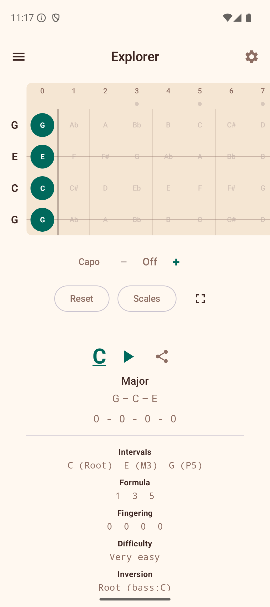
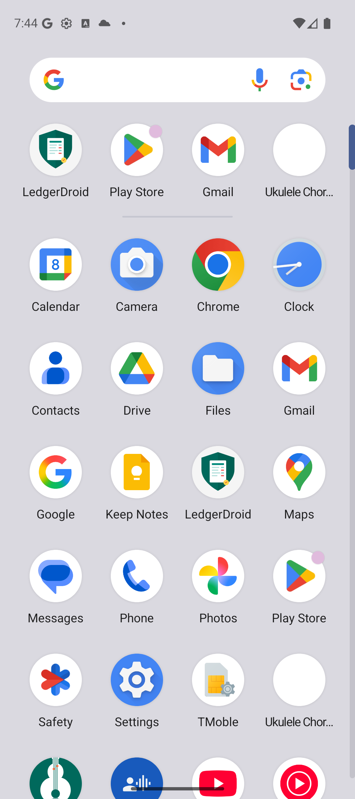

# Explorer

The Explorer is the main screen of Ukulele Companion. It shows an interactive fretboard where you can tap fret positions and the app instantly detects and displays the chord you are playing.

## Tapping Notes

Tap any fret cell on the fretboard to place or remove a finger. The fretboard displays frets 0 through 12 across four strings (G, C, E, A in standard tuning).

As you tap frets, the app analyzes the selected notes and shows the detected chord name above the fretboard. The app recognizes 9 chord types: Major, Minor, Dom7, Min7, Maj7, Diminished, Augmented, Sus2, and Sus4.

## Transpose

Below the detected chord, you will see **+** and **-** buttons to transpose the chord up or down by semitones. The app also shows the equivalent capo position for reference.

## Scale Overlay

The scale overlay highlights notes from a selected scale directly on the fretboard. This is helpful for understanding which notes fit within a key while you explore chords.

To use the scale overlay:

1. Scroll down below the fretboard to find the **Scale** section.
2. Toggle the scale overlay on.
3. Select a **root note** (e.g., C, G, D).
4. Select a **scale type** (Major, Minor, Pentatonic Major, Pentatonic Minor, Blues, Dorian, or Mixolydian).

Scale notes are highlighted on the fretboard, with the root note shown in a distinct color.

### Scale Positions

When a scale is active, a row of **Position** chips appears. These let you focus on a specific fret range:

- **All** — shows all scale notes across the entire fretboard (default).
- **Position 1, 2, 3...** — limits the highlighted notes to a specific fret range, making it easier to practice one position at a time.

Tap a position chip to filter, and tap **All** to go back to showing every note.

### Key-Aware Note Spelling

When a scale overlay is active, the fretboard automatically uses the correct note spelling for that key. For example, in the key of F major, the note between A and B is shown as "Bb" (flat), while in the key of G major, the note between F and G is shown as "F#" (sharp). This follows standard music theory conventions.

### Chords in This Scale

Below the position chips, the app lists the **chords that naturally occur** in the selected scale. Tap any chord chip to jump to its voicings in the Chord Library.

## Sound Playback

If sound is enabled in Settings, the app plays back the notes when you tap the fretboard. You can also tap the **Play** button to hear the current chord strummed. See [Settings](08-settings.md) for sound options.

## Full-Screen Mode

Tap the **full-screen icon** in the top-right corner to expand the fretboard to fill the entire screen, hiding the top bar and other controls.
