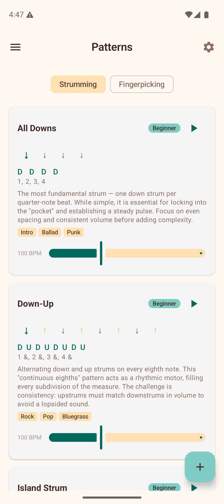
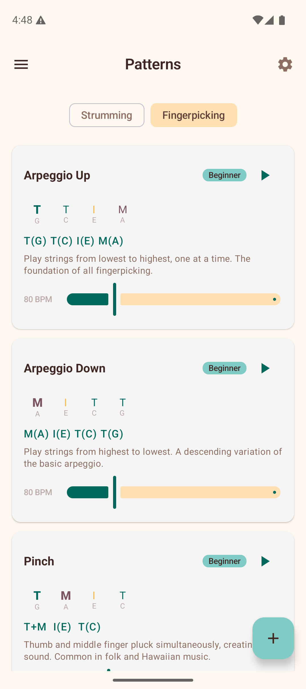

# Patterns

The Patterns section provides a reference guide for strumming and fingerpicking patterns. Use the toggle chips at the top to switch between the two views.

## Strumming Patterns

The **Strumming** tab shows a list of preset strumming patterns, from beginner to intermediate. Each pattern card includes:

- **Name** — e.g., "Island Strum", "Calypso", "Ska Upstroke".
- **Difficulty badge** — Beginner or Intermediate.
- **Visual beat arrows** — down arrows, up arrows, and miss/pause indicators showing the rhythmic pattern.
- **Notation** — a text representation of the pattern (e.g., "D DU UDU").
- **Description** — a brief explanation of the pattern and when to use it.
- **Suggested tempo** — a BPM range for practicing the pattern.

### Creating Custom Patterns

Tap the **+ button** (floating action button) in the bottom-right corner to create your own strumming pattern:

1. Enter a **pattern name**.
2. Tap each **beat slot** to cycle through directions: Down, Up, Miss, and Pause.
3. Tap the **accent row** below to toggle emphasis on individual beats (accented beats are shown louder/bolder).
4. Tap **Save** to add it to your custom patterns.

Your custom patterns appear in a **"My Patterns"** section at the top of the list. Each custom pattern has a **delete button** to remove it.

## Fingerpicking Patterns

The **Fingerpicking** tab shows reference patterns for fingerstyle playing. Each card includes:

- **Name** — e.g., the pattern name and style.
- **Difficulty badge** — similar to strumming patterns.
- **Finger step display** — color-coded indicators showing which finger (Thumb, Index, Middle, Ring) plucks which string at each step.
- **Notation** — a text representation of the fingerpicking sequence.
- **Description** — guidance on technique and musical context.
- **Suggested tempo** — a BPM range for practice.

The finger indicators use distinct colors for each finger, making it easy to follow the picking pattern visually. Emphasized steps are shown in a bolder weight.

## Tips

- Start with the beginner patterns and work your way up.
- Use the suggested BPM ranges as a guide — start slower and increase tempo as you get comfortable.
- Create custom strumming patterns to save patterns you learn from songs or teachers.
