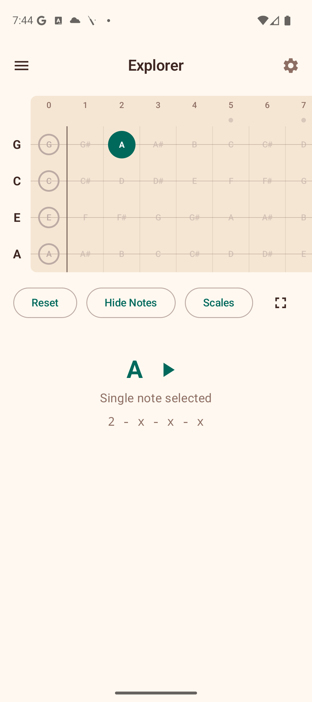

# Favorites

The Favorites section stores your saved chord voicings for quick access. You can organize them into folders for better management.

## Saving a Favorite

To save a voicing to your favorites:

1. Go to the **Chords** section.
2. Find a voicing you like.
3. **Long-press** the voicing diagram — a heart icon confirms it has been saved.

You can also tap the **heart icon** on any voicing in the library to toggle it as a favorite.

## Viewing Favorites

Open the **Favorites** section from the navigation drawer. Your saved voicings appear in a grid, showing the chord name and a mini fretboard diagram for each.

- **Tap** a voicing to load it onto the Explorer fretboard.
- Tap the **heart icon** on a voicing to remove it from favorites.

## Organizing with Folders

Favorites can be organized into folders using the **filter chips** at the top of the screen:

- **All** — shows every saved voicing (default).
- **Unfiled** — shows voicings not assigned to any folder.
- **Your folders** — each folder you create appears as a chip with the count of voicings inside.

### Creating a Folder

1. Tap the **+ chip** at the end of the filter row.
2. Enter a folder name in the dialog.
3. Tap **Create**.

The new folder appears as a chip in the filter row.

### Moving Voicings to a Folder

1. Tap the **folder icon** (small + icon) on any voicing.
2. A dialog appears listing all your folders plus "Unfiled".
3. Tap a folder name to move the voicing there.

### Deleting a Folder

Tap the **delete icon** on a folder chip. The folder is removed, and all voicings inside it are moved back to "Unfiled". The voicings themselves are not deleted.

## Tips

- Use folders to group voicings by song, practice session, or chord type.
- The "All" chip always shows your complete collection regardless of folder assignments.
- Removing a voicing from favorites (via the heart icon) deletes it entirely, while moving it to "Unfiled" keeps it saved.
