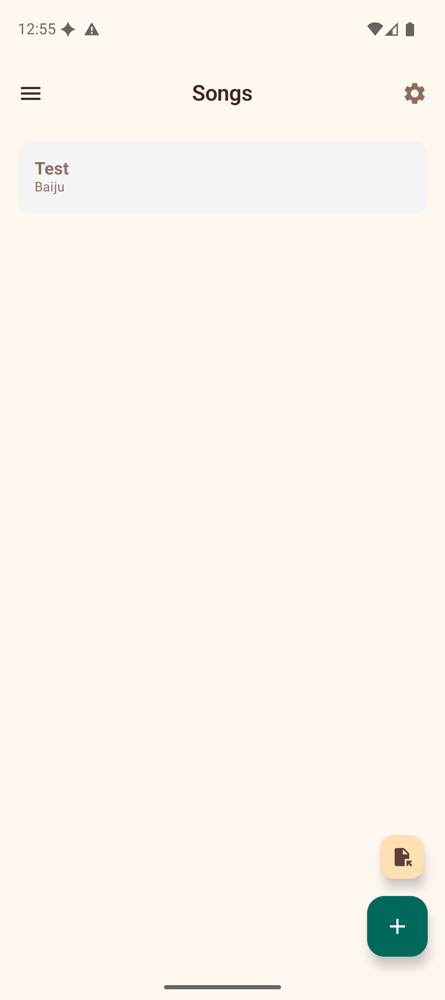

# Songs

The Songs section is your personal songbook. Create chord sheets with lyrics and inline chord markers, then use them as a reference while playing.



## Creating a Chord Sheet

1. Tap the **+ button** to create a new song.
2. Enter a **title** for the song.
3. In the content area, type your lyrics with chord markers using square bracket notation:

   ```
   Some[C]where over the [Em]rainbow
   [F]Way up [C]high
   ```

4. Tap **Save** to add the song to your collection.

## Importing Songs

You can import chord sheets from files on your device:

1. Tap the **import button** (file icon) at the bottom of the songs list.
2. Select a file from your device. The app supports:
   - **ChordPro files** (`.chopro`, `.cho`, `.chordpro`) — parsed automatically with title, artist, and chord directives.
   - **Plain text files** — imported as-is with the filename used as the title.
3. The imported song is added to your collection immediately.

## Viewing a Chord Sheet

Tap any song in the list to open it. The viewer renders your text with chords displayed inline above the lyrics in a highlighted style.

**Tap any chord name** in the viewer to jump directly to its voicings in the Chord Library. This makes it easy to look up unfamiliar chords while practicing a song.

### Key Detection

The app automatically analyses the chords in your song and displays the **detected key** (e.g., "Key: C Major") at the top of the viewer. This uses a simplified Krumhansl–Schmuckler algorithm to determine the best-fitting key.

## Auto-Scroll

The song viewer includes an **auto-scroll** feature so you can keep both hands on your ukulele while reading lyrics:

1. Tap the **play button** (floating action button) in the bottom-right corner to start auto-scrolling.
2. While scrolling, **speed controls** appear as chips: **0.5x**, **1x**, **2x**, and **3x**. Tap a chip to change the scroll speed.
3. Tap the **pause button** to pause auto-scrolling temporarily.
4. Tap the **stop button** to stop auto-scrolling and reset to the top.
5. If you manually scroll or swipe the screen while auto-scroll is active, it pauses automatically.

This is especially useful during practice or performance when you cannot tap the screen to scroll manually.

## Transposing Songs

The song viewer includes **transpose controls** to shift all chords up or down by semitones. This is helpful when a song is in a key that does not suit your voice or playing style. The original text is preserved — only the displayed chord names change.

When a transposition is active, the app also displays an equivalent **capo suggestion**. For example, if you transpose up 5 semitones, the app shows "Or use Capo 5 with original chords" — so you can choose whichever approach you prefer.

## Exporting and Sharing

The share button in the song viewer offers two options:

- **Share as text** — sends the chord sheet as plain text via any messaging or sharing app.
- **Export as ChordPro** — generates a ChordPro-formatted file with proper directives (`{title:}`, `{artist:}`, section markers) for use in other chord sheet apps.

## Editing and Deleting

- Tap the **edit button** on a song to modify its title or content.
- Tap the **delete button** to remove a song from your collection.

## Tips

- Use the `[ChordName]` bracket notation to mark chords anywhere in your lyrics.
- Auto-scroll at 0.5x or 1x speed is good for slow ballads; try 2x or 3x for faster songs.
- Import ChordPro files from other apps or websites to quickly build your songbook.
- The capo suggestion makes transposition practical — you can see the easy chord shapes at a glance.
