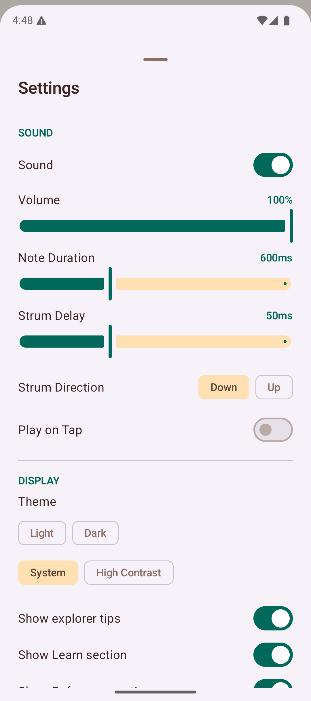
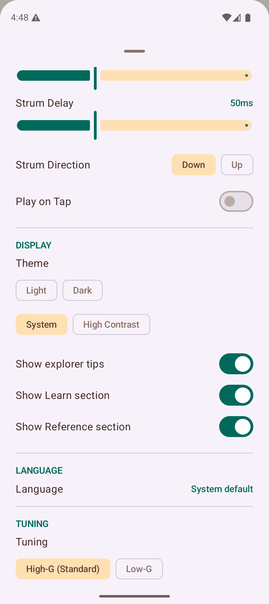

# Settings

Tap the **gear icon** in the top-right corner of the app bar to open the Settings panel. Settings are organized into sections.

## Sound

Control how the app plays back chords and notes.

| Setting | Description |
|---------|------------|
| **Sound enabled** | Toggle all sound playback on or off. |
| **Volume** | Adjust the playback volume from 0% to 100%. |
| **Note Duration** | How long each note rings out (300–1200 ms). |
| **Strum Delay** | The delay between strings when strumming a chord (20–150 ms). A shorter delay sounds like a quick strum; a longer delay sounds like a slow arpeggio. |
| **Strum Direction** | Choose between strumming down (low to high) or up (high to low). |
| **Play on Tap** | When enabled, plays the note immediately when you tap a fret on the Explorer fretboard. |

## Display

Customize the app's appearance and navigation.

### Theme

Choose from four theme options:

| Theme | Description |
|-------|------------|
| **Light** | Light background with dark text. |
| **Dark** | Dark background with light text, easier on the eyes in dim environments. |
| **System** | Follows your device's system-wide light/dark mode setting. |
| **High Contrast** | An accessibility-focused theme with stronger color contrast, making text and UI elements easier to read. Adapts to your system light/dark preference. |

### Navigation Sections

| Setting | Description |
|---------|------------|
| **Show explorer tips** | When enabled, a rotating "Did you know?" card appears on the Explorer tab. |
| **Show Learn section** | When enabled, the Learn section (Theory, Quizzes, Ear Training, etc.) is visible in the navigation drawer. Disable to simplify the drawer for experienced players. |
| **Show Reference section** | When enabled, the Reference section (Capo Guide, Circle of Fifths, Glossary, etc.) is visible in the navigation drawer. |

## Tuning

Select the tuning for your ukulele. The app adjusts the fretboard, chord detection, and playback accordingly.

| Tuning | Strings | Description |
|--------|---------|------------|
| **High-G (Standard)** | G4-C4-E4-A4 | The most common soprano/concert/tenor tuning with a re-entrant high G string. |
| **Low-G** | G3-C4-E4-A4 | Same notes but with the G string tuned an octave lower, extending the bass range. |
| **Baritone (DGBE)** | D3-G3-B4-E4 | Baritone ukulele tuning, matching the top four strings of a guitar. |
| **D-Tuning (ADF#B)** | A4-D4-F#4-B4 | A traditional alternative tuning, one whole step above standard. |

## Fretboard

| Setting | Description |
|---------|------------|
| **Left-Handed** | Mirrors the fretboard so the nut appears on the right side, matching a left-handed player's perspective. |

## Tips

- If you play a baritone ukulele, switch to the **Baritone (DGBE)** tuning so chord detection and playback match your instrument.
- Try the **High Contrast** theme if you find the default colors hard to read, especially in bright sunlight.
- Adjust the **volume slider** independently from your device volume for finer control over playback loudness.
- Disable the **Learn** and **Reference** sections if you want a simpler navigation drawer focused on playing and creating.
