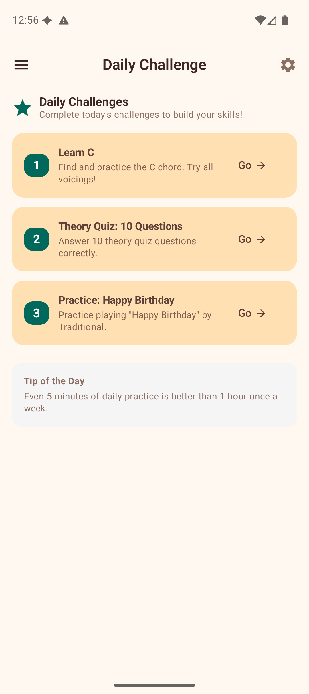
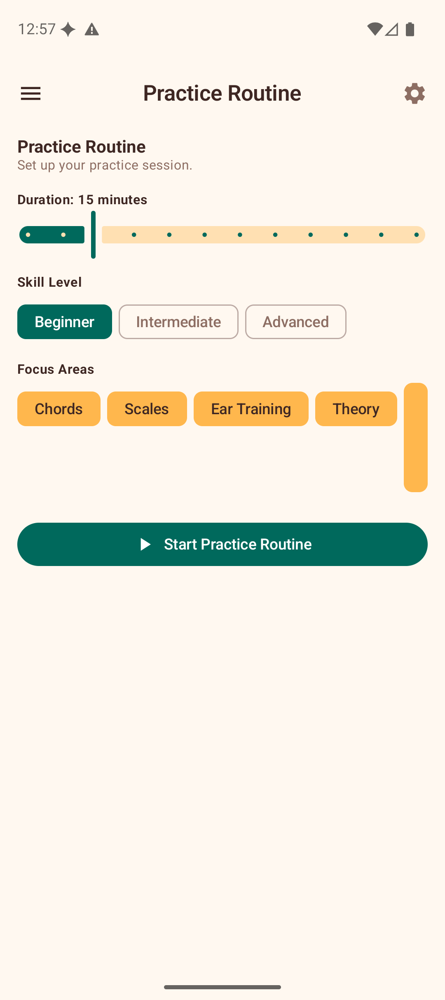

# Learning & Practice

Ukulele Companion includes a suite of learning and practice tools to help you build skills systematically. Access them from the **Learn** section of the navigation drawer.

## Progress Dashboard

The Progress screen is your central hub for tracking improvement across all learning activities.

### Practice Time

At the top of the dashboard, the **Practice Time** card shows:

- **Today** — minutes practised today.
- **Total** — cumulative practice time across all sessions.
- **Sessions** — total number of practice sessions.
- **Daily goal** — progress bar towards your configurable daily target (default 15 minutes).

Practice time is tracked automatically whenever the app is open. Sessions longer than 1 minute are recorded when you leave the app.

### Statistics

Below the practice timer, the dashboard shows stats for each training activity:

- **Theory Lessons** — lessons completed and quizzes passed.
- **Theory Quiz** — overall score and accuracy.
- **Interval Trainer** — accuracy and attempts.
- **Note Quiz** — score, accuracy, and best streak.
- **Chord Ear Training** — accuracy and attempts.

## Daily Challenge

Three fresh challenges are generated every day to keep your practice varied and engaging.

Each challenge card shows:

- A **numbered badge** (1, 2, 3).
- The **challenge description** (e.g., "Learn C", "Theory Quiz: 10 Questions", "Practice: Happy Birthday").
- A **Go** button that navigates directly to the relevant section of the app.

Below the challenges, a **Tip of the Day** provides a quick piece of practice advice.

Challenges are generated deterministically based on the date, so they are the same if you check multiple times in a day but different each new day.

## Practice Routine

The Practice Routine builder creates a structured, guided session tailored to your needs.

### Setting Up

1. **Duration** — drag the slider to set your available time (5–60 minutes).
2. **Skill Level** — choose Beginner, Intermediate, or Advanced.
3. **Focus Areas** — select which skills to include: Chords, Scales, Ear Training, Theory, Songs.
4. Tap **Start Practice Routine**.

### Following the Routine

The app generates a sequence of steps:

- **Warm-up** — a gentle start (e.g., easy chord changes).
- **Focused exercises** — exercises matched to your focus areas and skill level, each with a suggested duration.
- **Cool-down** — a relaxing finish.

Each step shows a description, time allocation, and a **Go** button to navigate to the relevant feature. Mark steps complete as you finish them. A progress bar tracks your overall routine completion.

## Achievements

Earn badges by reaching milestones as you use the app.

### Achievement Categories

- **Practice** — streaks and consistency (e.g., "Getting Started" for a 3-day streak, "Monthly Master" for 30 days).
- **Learning** — lesson and quiz milestones (e.g., "First Steps" for completing your first lesson, "Scholar" for all lessons).
- **Ear Training** — interval and chord ear training accuracy.
- **Collection** — favorites and song milestones.

### Viewing Achievements

The gallery shows a progress bar (e.g., "1 / 21 unlocked") and lists all achievements. Filter by category using the chips at the top. Locked achievements are shown dimmed with their unlock criteria visible, so you always know what to work towards.

## Song Finder

Song Finder suggests songs you can play based on the chords in your Favorites.

Your known chords are shown at the top. Below, the app lists:

- **Playable songs** — songs using only chords you know.
- **Almost playable songs** — songs where you are missing just 1–2 chords. The missing chords are highlighted with a "Learn:" label. Tap a missing chord to jump to its voicings in the Chord Library.

Each song card shows the title, artist, difficulty level, genre, and the chords used.

## Tips

- Check the Daily Challenge each day for motivation and variety.
- Use Practice Routine when you have a set amount of time and want structure.
- Review the Progress dashboard periodically to identify areas that need more attention.
- Add chords to Favorites to expand what Song Finder can recommend.
