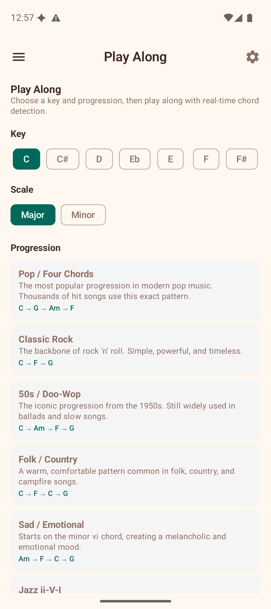
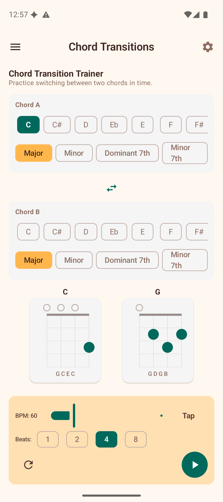

# Play Along & Chord Training

These features use real-time audio and animation to help you practise chord changes and playing accuracy.

## Play Along

Play Along lets you practise a chord progression with real-time feedback from your microphone. The app listens to your ukulele and tells you whether you are playing the correct chord.

### Setup

1. **Choose a key** — tap a note chip (C, C#, D, ... B).
2. **Choose a scale** — Major or Minor.
3. **Select a progression** — tap a progression card. Each card shows the name, description, and the resolved chord names in your chosen key (e.g., "C → G → Am → F").

### Playing

After selecting a progression, the play-along screen appears with:

- **Chord timeline** — a horizontal row of all chords in the progression. The current chord is highlighted.
- **Current chord display** — a large card showing the chord you should be playing right now.
- **Live detection feedback** — when the microphone is active, the app shows what chord it hears and whether it matches the expected chord (green check for correct, red X for incorrect).
- **Score card** — accuracy percentage, letter grade (S/A/B/C/D/F), and best streak.

### Controls

- **BPM slider** — adjust the tempo from 40 to 180 BPM.
- **Tap Tempo** — tap rhythmically to set the BPM by feel.
- **Beats per chord** — choose 2, 4, or 8 beats before the progression advances to the next chord.
- **Play/Stop button** — starts or stops the session. When playing, the metronome keeps time and the progression advances automatically.

### Microphone Permission

Play Along requires microphone access for chord detection. The first time you use it, the app will prompt you to grant permission. If you decline, you can still use the progression playback and metronome without detection feedback.

### Scoring

Each beat is scored based on whether the detected chord matches the expected chord. At the end of a session (or when you stop), the score card shows:

- **Accuracy** — percentage of beats with correct chord detection.
- **Grade** — a letter grade from S (95%+) to F (below 40%).
- **Best Streak** — the longest consecutive run of correct beats.

## SRS Review

The Spaced Repetition System helps you memorise chord voicings through optimally-timed reviews.

### How It Works

SRS uses the **SM-2 algorithm** (the same method used by popular flashcard apps) to schedule reviews:

1. **Add cards** — from the Chord Library, long-press a voicing and select "Add to SRS". The chord name and fingering are saved as a review card.
2. **Review due cards** — open SRS Review to see cards that are due. The app shows the chord name and asks you to recall the fingering.
3. **Reveal and rate** — tap to reveal the chord diagram, then rate your recall:
   - **Again** — you could not remember. The card will be shown again soon.
   - **Hard** — you remembered with difficulty. The interval increases slightly.
   - **Good** — you remembered correctly. The interval increases normally.
   - **Easy** — you remembered instantly. The interval increases significantly.
4. **Repeat** — the algorithm schedules each card's next review based on your rating. Cards you struggle with appear more often; cards you know well appear less frequently.

### Dashboard

The SRS Review screen shows:

- **Due** — cards ready for review right now.
- **Reviewed** — cards reviewed in this session.
- **Total** — total cards in your deck.

If you have no cards yet, the screen explains how to add them from the Chord Library.

## Chord Transitions

The Chord Transition Trainer helps you practise switching between two chords with an animated fretboard visualisation.

### Setup

1. **Chord A** — select the root note and chord type for the starting chord.
2. **Chord B** — select the root note and chord type for the target chord.

The app displays both chord diagrams side by side so you can see the finger positions.

### Animation

Below the diagrams, an animated fretboard shows how your fingers move from Chord A to Chord B:

- Fingers that **stay** in place are shown as stationary dots.
- Fingers that **slide** along a string are animated smoothly.
- Fingers that **lift** off are shown moving away.
- Fingers that **place** onto a new position are shown arriving.

### Controls

- **BPM slider** — controls the animation speed.
- **Tap Tempo** — set the speed by tapping.
- **Beats** — choose 1, 2, 4, or 8 beats per transition cycle.
- **Play button** — starts the repeating animation.
- **Reset button** — resets the animation to the start.

A text description of each finger movement is shown alongside the animation (e.g., "Index: slide from fret 1 to fret 2", "Ring: lift off").

## Tips

- Start Play Along at a slow BPM (60–80) and increase as you get comfortable.
- Add your most-used chords to SRS so you always remember the fingerings.
- Use Chord Transitions to practise the specific chord changes that give you trouble.
- Combine these tools: use Chord Transitions to learn a change, then Play Along to practise it in context.
